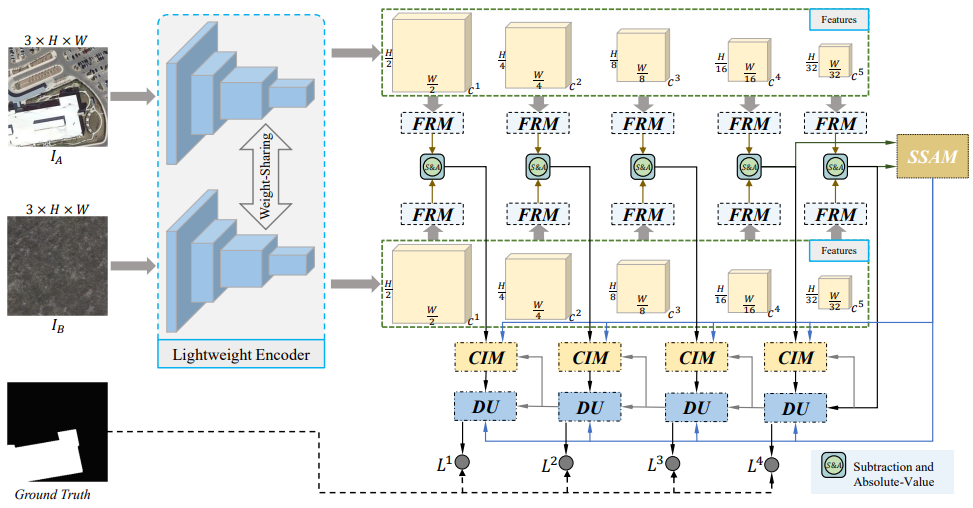
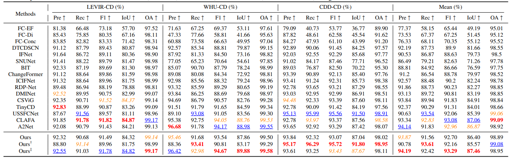
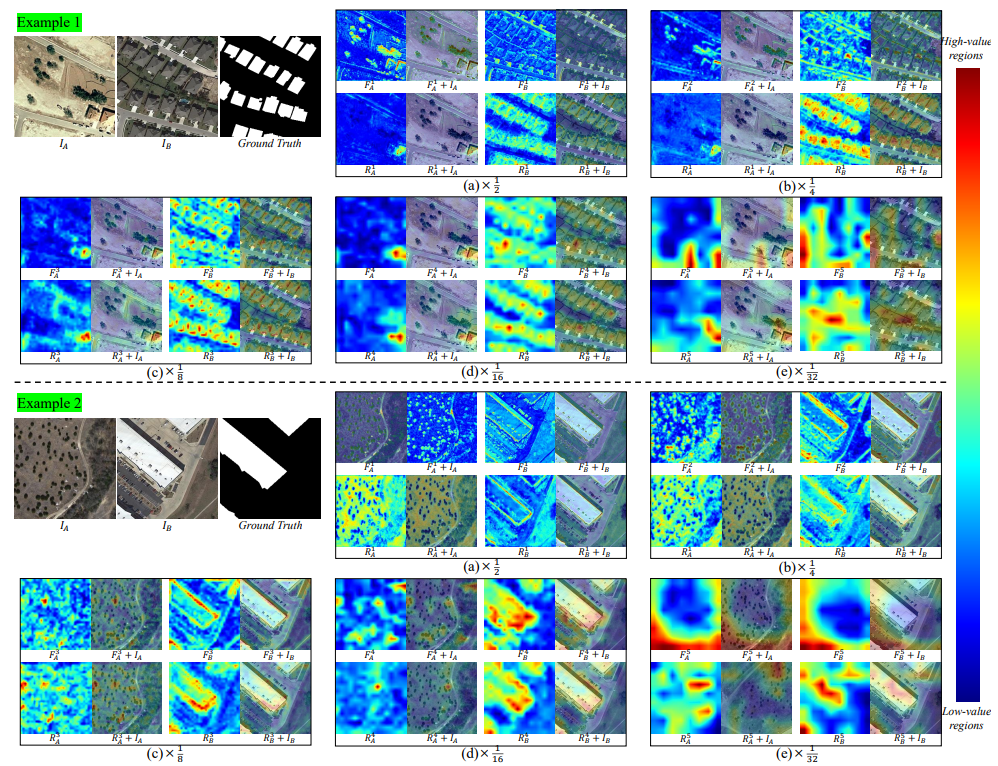

# <p align=center>`Robust feature aggregation network for lightweight and effective remote sensing image change detection (ISPRS 2024)`</p>

> **Authors:**
Zhi-Hui You; Si-Bao Chen; Jia-Xin Wang; Bin Luo

This repository contains simple python implementation of our paper [RFANet](https://www.sciencedirect.com/science/article/abs/pii/S092427162400251X).

### 1. Overview

<p align="center">
     <br />
</p>

 A lightweight change detection network, called as robust feature aggregation network (RFANet). To improve representative capability of weaker features extracted from lightweight backbone, a feature reinforcement module (FRM) is proposed. FRM allows current level feature to densely interact and fuse with other level features, thus accomplishing the complementarity of fine-grained details and semantic information. Considering massive objects with rich correlations in RS images, we design semantic split-aggregation module (SSAM) to better capture global semantic information of changed objects. Besides, we present a lightweight decoder containing channel interaction module (CIM), which allows multi-level refined difference features to emphasize changed areas and suppress background and pseudo-changes. <br>

### 2. Usage
#### 2.1 Dataset
+ Prepare the data:
    Download the change detection datasets from the following links. Place them inside your `datasets` folder.

    - [`LEVIR-CD`](https://www.dropbox.com/s/18fb5jo0npu5evm/LEVIR-CD256.zip?dl=0)
    - [`WHU-CD`](https://www.dropbox.com/s/r76a00jcxp5d3hl/WHU-CD-256.zip?dl=0)
    - [`CDD-CD`](https://www.dropbox.com/s/ls9fq5u61k8wxwk/CDD.zip?dl=0)
    - [`SYSU-CD`](https://github.com/liumency/SYSU-CD)
    - [`./samples/test`]() is a sample to start quickly.
- Crop all datasets into 256x256 patches.
- Generate list file as `ls -R ./label/* > test.txt`
- Prepare datasets into following structure and set their path in `train.py` and `test.py`
  ```
  ├─Train
      ├─A        ...jpg/png
      ├─B        ...jpg/png
      ├─label    ...jpg/png
      └─list     ...txt
  ├─Val
      ├─A
      ├─B
      ├─label
      └─list
  ├─Test
      ├─A
      ├─B
      ├─label
      └─list
  ```
#### 2.2 Setting up conda environment
+ Prerequisites for Python:
    - Creating a virtual environment in terminal: `conda create -n RFANet python=3.8`
    - Installing necessary packages: `pip install -r requirements.txt `

#### 2.3 Installation
+ Clone this repo:
    ```shell
    git clone https://github.com/Youzhihui/RFANet.git
    cd RFANet
    ```
#### 2.4 Quick Start
+ Train/Test
    - `sh ./train_test_tools/train.sh`
    - `sh ./train_test_tools/test.sh`

### 3. Change Detection Results
<p align="center">
     <br />
   The quantitative results of different CD methods on LEVIR-CD, WHU-CD, and CDD-CD. The last column indicates the mean value of same report on different datasets. Color convention: <font color="#FF0000"><strong>best</strong></font> (red-bold), <font color="#00B0F0"><u>2nd-best</u></font> (blue-underline), and <font color="#FFA500"><i>3nd-best</i></font> (orange-italic).
</p>

<p align="center">
     <br />
    <em> 
    Heatmap visualizations of multiple levels for RFANet.
    </em>
</p>

### 4. Acknowlogdement
This repository is built under the help of the projects  [A2Net](https://github.com/guanyuezhen/A2Net), [BIT_CD](https://github.com/justchenhao/BIT_CD), 
[CDLab](https://github.com/Bobholamovic/CDLab), and [MobileSal](https://github.com/yuhuan-wu/MobileSal) for academic use only.

### 5. Citation

Please cite our paper if you find the work useful:

    @article{you2024robust,
        title={Robust feature aggregation network for lightweight and effective remote sensing image change detection},
        author={You, Zhi-Hui and Chen, Si-Bao and Wang, Jia-Xin and Luo, Bin},
        journal={ISPRS Journal of Photogrammetry and Remote Sensing},
        volume={215},
        pages={31--43},
        year={2024},
        publisher={Elsevier}
        }
